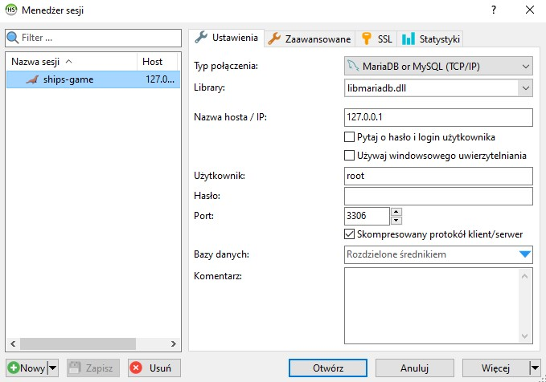
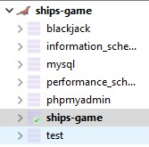

# battleship-app

- otwórz projekt w IntelliJ'u
- otwórz XAMPP'a
- wciśnij START przy module MySQL
- otwórz HeidiSQL
- kliknij w przycisk 'Nowy'
- nadaj nazwę i resztę ustawień jak na zdjęciu:
  
- kliknij w przycisk 'Otwórz'
- wybierz bazę 'ships-game' jak na zdjęciu:

  
- kliknij w zakładkę 'Kwerenda'
- wybierz opcję 'Nowa zakładka zapytań'
- otwórz plik 'database-ships-app.txt', który znajduje się w folderze projektu
- przekopiuj treść pliku i wklej ją do wcześniej utworzonej nowej zakładki zapytań w HeidiSQL
- wciśnij F9
- otwórz klasę 'StartApplication' w IntelliJ'u (src\main\java\com\example\statki\StartApplication.java)
- kliknij prawy przycisk i wybierz opcję 'Run 'StartApplication.main()''